

**Developed By:** Khubab Shamsuddin

[Live website link](https://kshamse.github.io/regions-quiz/index.html)

# Table of Contents

- [Table of contents](#table-of-contents)
- [Overview](#overview)
- [Goals](#goals)
    - [User's Goals](#users-goals)
    - [Site's Owner Goals](#sites-owner-goals)
- [User Stories](#user-stories)
    - [User's Stories](#users-stories)
    - [Site's Owner Stories](#sites-owner-stories)
- [Features](#features)
    - [Navigation Bar](#navigation-bar)
    - [Quiz Starting Form](#quiz-starting-form)
    - [Quick Tips](#quick-tips)
    - [Scoreboards](#scoreboards)
    - [Quiz Page](#quiz-page)
    - [Score Page](#score-page)
    - [Contact Us Form](#contact-us-form)
    - [Footer](#footer)
    - [Page 404](#page-404)
- [Testing](#testing)
    - [Design](#design)
      - [Responsiveness](#responsiveness)
      - [Colors & Fonts](#colors-and-fonts)
    - [Features Testing](#features-testing)
      - [Navigation Bar](#navbar)
      - [Quiz Starting Form](#quiz-form)
      - [Quick Tips](#tips)
      - [Scoreboards](#scoreboard)
      - [Quiz Page](#quiz)
      - [Score Page](#score)
      - [Contact Us Form](#contact-us)
      - [Footer](#footer-links)
      - [404 Page](#404-page)
    - [Lighthouse Report](#lighthouse-report)
    - [Validators Testing](#validators-testing)
    - [Interesting Solved Problems](#interesting-solved-problems)
    - [Unfixed Bugs](#unfixed-bugs)
    - [Deployment](#deployment)
- [Credits](#credits)
    - [Media](#media)
    - [Code](#code)
    - [Special Thanks](special-thanks)

# Overview

RegionQuiz is a site to test users' information of regions' names and helps them to grow their knowledge in a challenging interactive way. 
The site is targeted towards people who love geography and want to learn more about the world's regions and have fun at the same time. 

[(Back to top)](#table-of-contents)

# Goals

## User's Goals

- Play a quiz to test the knowledge of world countries' names.
- Learn more countries' names by the end of the quiz.
- Achieve top scores and be published on the scoreboard.

## Site's Owner Goals
- Build an entertainment channel to provide educational content in a question-answer shape.
- Provide an interactive user experience.

[(Back to top)](#table-of-contents)

# User Stories

## User's Stories
1. I want to know the quiz rules.
2. I want to be able to use any name to start the quiz.
3. I want to play a limited number of questions.
4. I want to be able to find a hint for the correct answer.
5. I want to use either the pointer or the keyboard to choose the correct answer.
6. I want to see my score, progress and time while playing the quiz.
7. I want to see my final score and finishing time.
8. I want to know my ranking among other users.
9. I want to be able to contact the site's owner and provide comments about the quiz.

## Site's Owner Stories
10. I want the user to deal with an easy-to-navigate and fully responsive site.
11. I want the user to know the correct answer at the end of each round.
12. I want the user to be motivated and challenged.
13. I want a transparent score-tracking system.
14. I want the user to be able to send me his feedback and comments.
15. I want the user to load a 404 styled page when he entered an invalid internal link.

[(Back to top)](#table-of-contents)

# Features 

## Navigation Bar
  - Built to ease the site navigation and as the site is a single-page application the navigation bar provides the user with quick access to all page sections in addition to the contact us fetched form.
  - Shows the site logo and interacts with the user pointer movement.
  - *Covered User stories: 10*

  

## Quiz Starting Form
 
  - The quiz starting point, includes:
    - Nick Name:
        - input for the user to enter a name.
        - user is required to fill in this input, in case he tried to start the quiz before filling it a feedback message will pop up to notify the user about it.
    - Levels:
        - a group of buttons to let the user choose the suitable level.
    - Start button:
        - to allow the user to start the quiz when he is ready to.
        - clicking on this button shows the quiz page, with scrolling to the question area.
  - *Covered User stories: 2,3*

  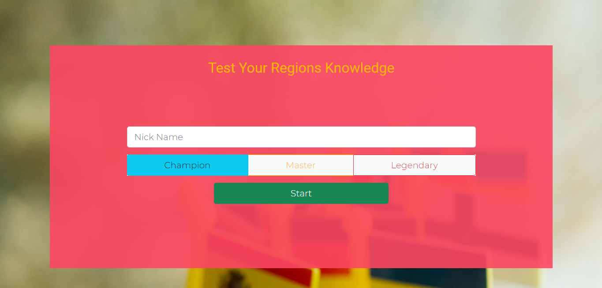

## Quick Tips

  - Text block to provide the user with the required information about the quiz rules and tricks.
  - Describes the way to play the quiz and the points system in addition to how ranking works.
  - *Covered User stories: 1*

  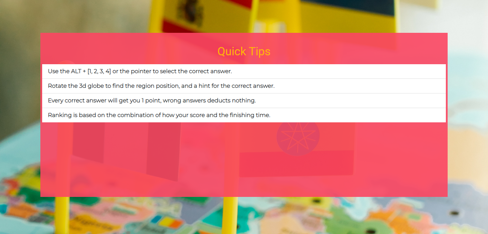

## Scoreboards
  
  - Score tracking screen which shows the top ten high scorer users in different levels.
  - Top ranking for users who scored more points in less time.
  - *Covered User stories: 8,12,13*
  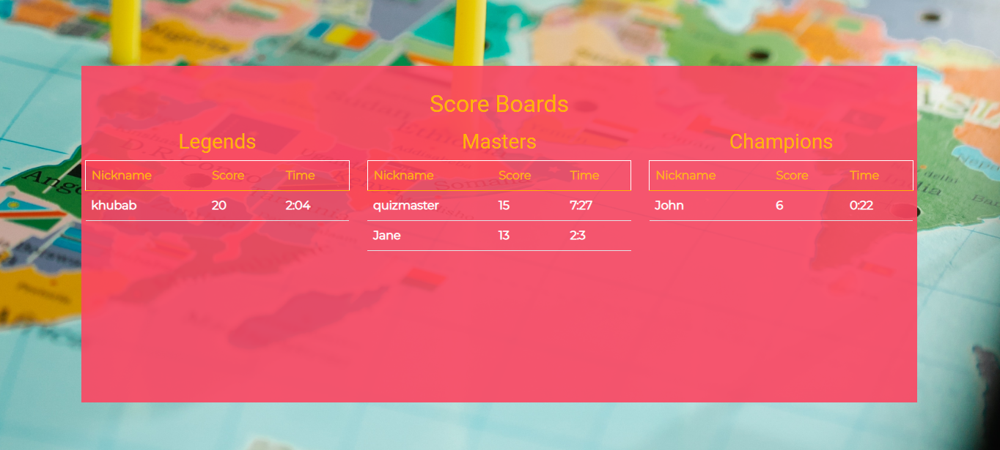
  
  - Google Firestore is used to store users' score data. 
  - Each Firestore document includes username, level, time, and score.
  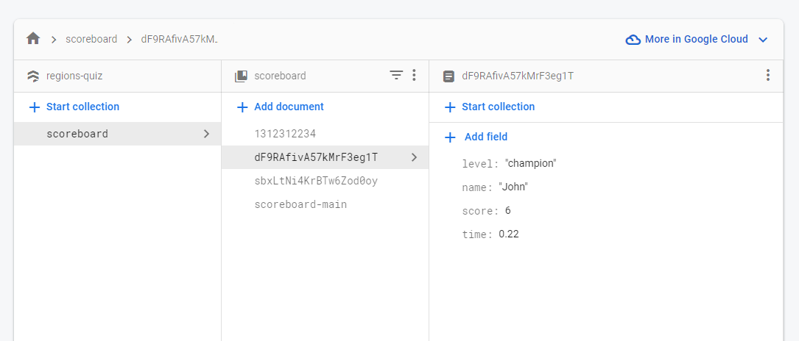

## Quiz Page

  - Opens at the top of the page and contains separated sections as follows:
   - Globe map:
        - HighCharts™️ world map to provide the position and a hint of the questioned region.
        - *Covered User stories: 4*
   - Quiz info area:
        - Progress bar and questions counter: indicates the user's progress while doing the quiz.
        - Score pad: to help the user to track his score.
        - Timer: live consumed time tracking.
        - *Covered User stories: 6,13*
   - Question area:
        - Question: fixed question text contains the capital and the continent names of the questioned region, styled to be clear and easy to read.
        - Answer buttons: four possible answers choices,
        - The user could choose the correct answer using the pointer or the keyboard shortcut ALT + answer number for quick selection.
        - Answer button style changed at the end of each round to indicate the correct answer and the wrong answer (if the user chose a wrong answer).
        - *Covered User stories: 4,5,11*

  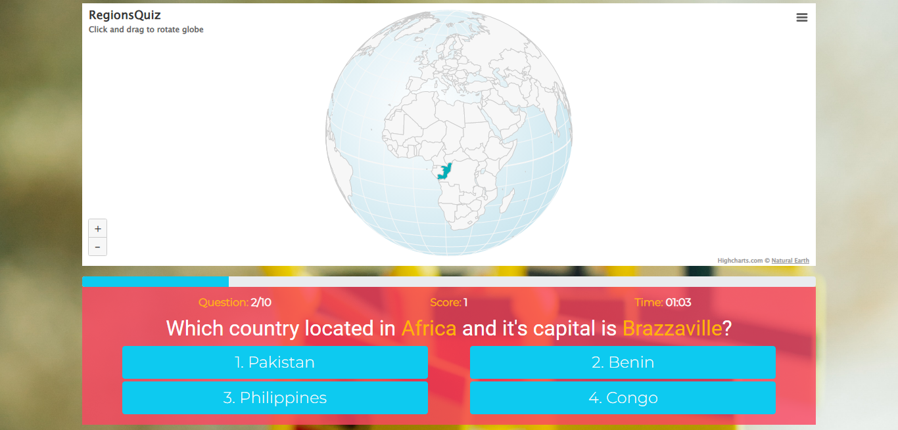

## Score Page

  - Provide the user with his final score and finishing.
  - The user's ranking among all previous scorers.
  - The trophy acquired by the user based on his ranking.
  - Links to share the final score on the user's social media accounts.
  - *Covered User stories: 7,8,12,13*

  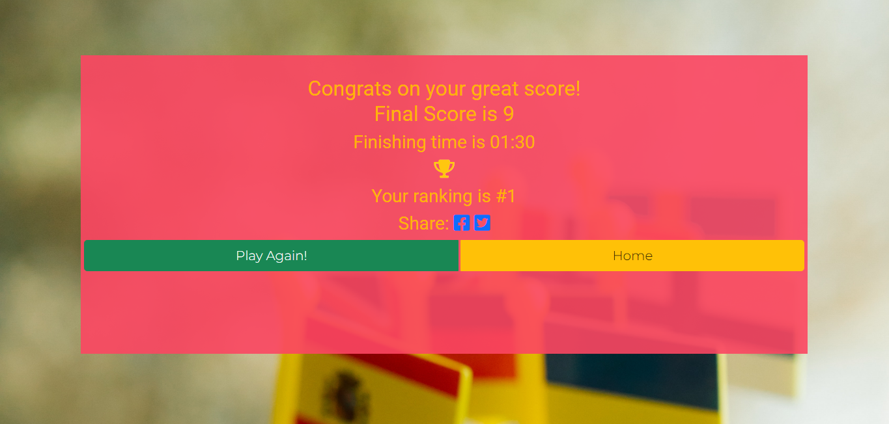
  
## Contact Us Form

  - a Form to help users provide their comments on the quiz and site experience.
  - a Feedback message shown at the form submission, indicates the mail status.
  - *Covered User stories: 9,14*

  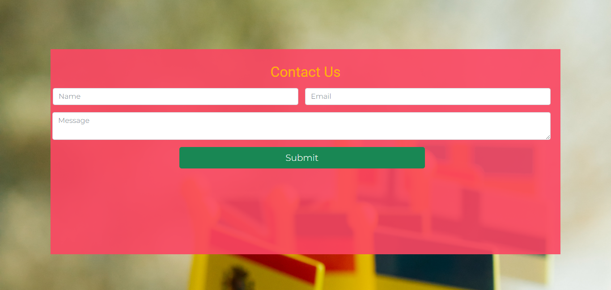
  
  

## Footer

  - Includes the option of mailing the site's owner and links to the site-related social media accounts/ pages.
  - *Covered User stories: 10*

  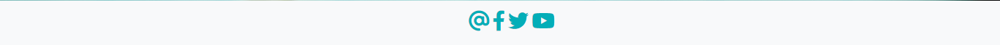

## Page 404

  - Built to provide feedback for the user who tried to access an un-supported URL.
  - *Covered User stories: 15*

  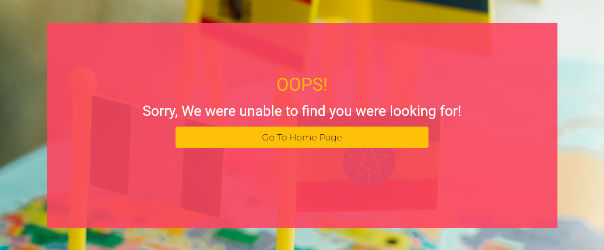

[(Back to top)](#table-of-contents)

# Testing 

## Design
### Responsiveness

- The website has been tested on Firefox and Safari browsers as well as on different devices' viewports using Google Chrome DevTools on Google Chrome browser, with no errors reported. 
- Testing Devices:
  - Dell Latitude 3570 Laptop.
  - Apple iPhone 6s.
  - Huawei Mate 20 Lite.

### Colors and Fonts

- Site designed based on a group of colour schemes that reflects both fun and educational content.

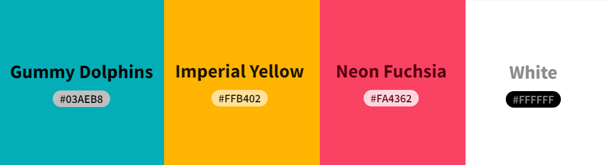

- Pairing 'Roboto' font for headings and 'Montserrat' for the rest of the text implemented on this site.

## Features Testing

### Navbar
  - Depending on the screen's viewport size navigation bar changes on small screens to be collapsible and provide the required responsivity.

  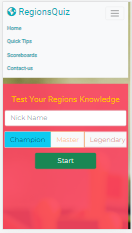

### Quiz Form
  - Validation on the contact form has been tested to ensure that the user must use a name to be published on the scoreboard by the end of the quiz.
  

  - With autofocus enabled the user could enter his name and press Enter to start without the need to move the pointer, which eases accessibility and enhance the user experience, level selection also could be done by Tab and Arrows.

### Tips
  - Written to guarantee that the user will have a clear understanding of quiz rules and tricks.

### Scoreboard
  - Only the top ten high scorers' records are shown, which gives the user the motivation to improve his result to be published on scoreboards.
  - Users score data query and render done after the page totally loaded thus it didn't affect the page loading.

### Quiz
  - Country position is shown on the world map for most countries (depends on the country size on the map).
  - Hovering the pointer on the question region show a hint of country code, and that will let the user recognize the correct answer.
  - Keyboard shortcuts tested and works as expected, providing a practical way to solve the quiz in the shortest amount of time.
  - When the user selected an answer all answer buttons are changed to be disabled to prevent a second selection, and the correct answer is coloured in green and the wrong (if selected) in red.
  - Score and progress are updated when a question round started, and the timer provides a live update, helping the user to make sure he gets a fair assessment.
  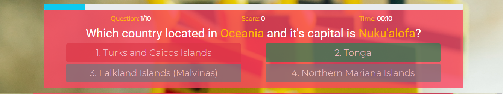

### Score
  - Final score, time and rankings were tested and they work as expected.
  - Trophy icon shown as a reward for high scorers, the top three ranked users get a coloured cup and a medal given to the top ten rankings.
  - Social media sharing will encourage potential users to challenge themselves and take the quiz.
  - Rewards system triggers motivation and challenge and keeps users trying to get the most valuable trophy or achieve top rankings.

### Contact Us
  - Users' communications with the site's owner are achieved through the contact form.
  - The user must provide an email in the correct email format in order to send his feedback.
  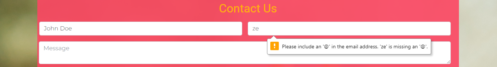

### Footer Links
  - All social media links have been tested and it is working properly.
  - Contact us link opens the contact us form and scroll the view to the form on top.

### 404 Page
  - Redirection to the 404 page when the user tries to access a site page with an invalid link working as expected.
## Lighthouse Report

- Desktop
  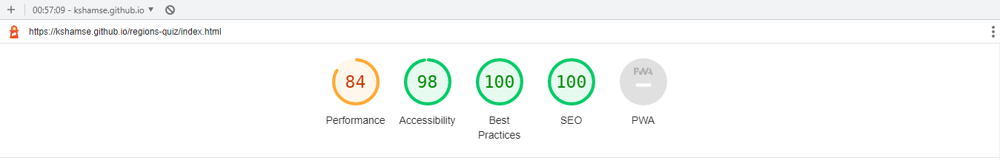

-  Mobile
  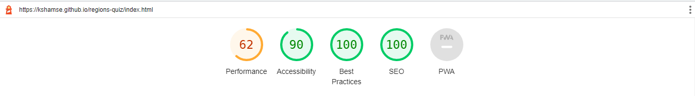

## Validators Testing 

- HTML
  - No errors were returned when passing through the official [W3C validator](https://validator.w3.org/nu/?doc=https%3A%2F%2Fkshamse.github.io%2Fregions-quiz%2Findex.html)
  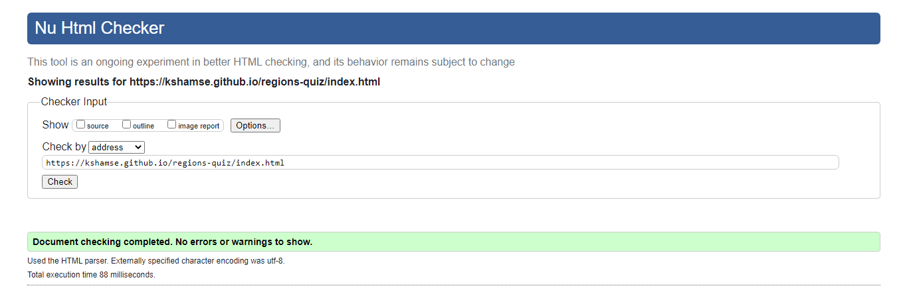

- CSS
  - No errors were found when passing through the official [(Jigsaw) validator](https://jigsaw.w3.org/css-validator/validator?uri=https%3A%2F%2Fkshamse.github.io%2Fregions-quiz%2Findex.html&profile=css3svg&usermedium=all&warning=1&vextwarning=&lang=en)
  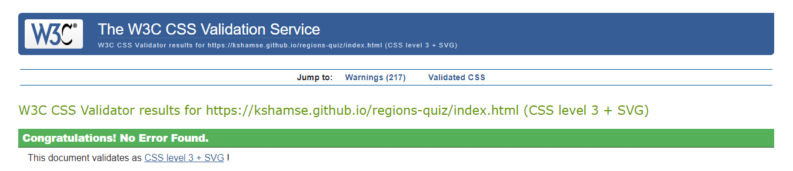

- JavaScript
  - JSHint report has been generated for quiz javascript code.
  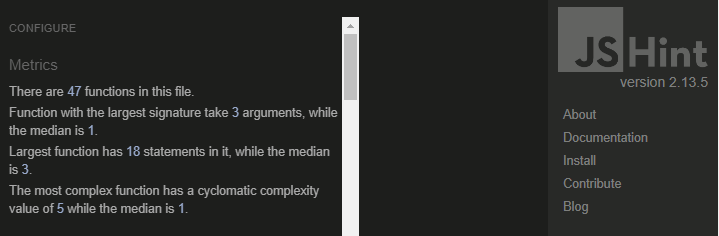

## Interesting Solved Problems

- EmailJS send form: `formData = new FormData(contactForm)` returns an empty `FormData` object, it's probably a result of putting this code wrapped by `AJAX function`, solved by getting each input value separately.

- Firestore multiple 'where' conditions: I tried different ways to add a couple of conditions inside the `where` parentheses inside the `query` but it keeps getting me errors, at the end turns out that all Firebase services originally are functions and therefore `query` is a function which receives a number of parameters (functions) and in case of `where` function it could receive more than one [Reference](https://firebase.google.com/docs/firestore/query-data/queries#compound_queries).

## Unfixed Bugs

- Radio Button Responsiveness: bootstrap radio button width size is not affected by the mobile screen, and overflows to exceed the parent limit.

## Deployment

- Site deployed on Github Pages, with the following steps:
  - On the project repository open `Settings`.
  - On the left sidebar click on `Pages`.
  - Keep the `source` drop-down on `Deploy from a branch`, and select the `main` branch.
  - Page will be refreshed automatically and the site link will appear on the top.

The live link can be found here - https://kshamse.github.io/regions-quiz/index.html, or by clicking on the logo at the top of this page. 

[(Back to top)](#table-of-contents)

# Credits

## Media
- The icons used in this site were from [Font Awesome](https://fontawesome.com/).
- Site's favicons generated by [Real Favicon Generator](https://realfavicongenerator.net/).
- Background photo has been downloaded from Pexels, uploaded by [Lara Jameson](https://www.pexels.com/photo/toy-flags-pinned-on-world-map-8828610/).
 
## Code
- The globe map on the question page source is the HighCharts blog uploaded by [Mustapha Mekhatria](https://www.highcharts.com/blog/code-examples/planet-earth/) and [The JSFiddle Reference](https://jsfiddle.net/gh/get/library/pure/highcharts/highcharts/tree/master/samples/maps/demo/topojson-projection).

- Countries data generated by [The HTML Code Generator](https://www.html-code-generator.com/javascript/json/country-names).

- Bootstrap setup and components have been with the help of [The Bootstrap Official Documentation](https://getbootstrap.com/docs/5.0/getting-started/introduction/).

- Firstore installation based on [The Firestore Setup Page](https://firebase.google.com/docs/web/setup).

- I get the queries on Firestore DB done by following [The Firestore Queries Tutorial](https://firebase.google.com/docs/firestore/query-data/queries).

- Contact Us mailing is provided by [EmailJs](https://www.emailjs.com) page built by using [Send Form API](https://www.emailjs.com/docs/rest-api/send-form/)
- Navigation bar source is [The W3School Tutorial](https://www.w3schools.com/bootstrap5/tryit.asp?filename=trybs_navbar_collapse).

- Creating a keyboard shortcut by Javascript is a [Post on DelftStack](https://www.delftstack.com/howto/javascript/javascript-keyboard-shortcut/).

- AJAX content loading is based on [Display Dynamic Content Tutorial on Code-Boxx](https://code-boxx.com/display-dynamic-content-html/).

- Export/ Import Javascript functions is an answer provided by [connexo on Stackoverflow](https://stackoverflow.com/questions/57382295/how-can-i-import-a-variable-from-another-javascript-file).

- Function of array shuffling was taken from [Fedingo](https://fedingo.com/how-to-shuffle-array-in-javascript/).

- Social media share links generation inspired by [AllisonC Answer](https://stackoverflow.com/questions/6138780/facebook-share-button-and-custom-text) and [Hubspot Blog By Anum Hussain](https://blog.hubspot.com/marketing/how-to-generate-click-to-tweet-links-cta-quick-tip-ht).

- Importing firebase functions by URLs is a solution provided by [Vatsal A Mehta on Stackoverflow](https://stackoverflow.com/questions/70730990/why-unable-to-resolve-module-specifier-firebase-app).

- [Chrome DevTools](https://developer.chrome.com/docs/devtools/) has been used to discover Javascript errors and test site responsiveness.

- This readme file is based on [Code Institute Readme Template](https://github.com/Code-Institute-Solutions/readme-template/blob/master/README.md) and edited with the help of [Navendu Pottekkat's Blog Post](https://towardsdatascience.com/how-to-write-an-awesome-readme-68bf4be91f8b).

- Grammatical errors and typos on this file were discovered and corrected by [Grammarly](https://app.grammarly.com/).
 
## Special Thanks 
- to mentor Mr Mo Shami for his continuous guidance and support.
