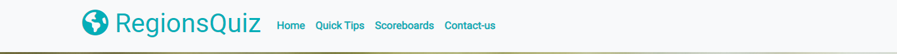

# Table of Contents

- [Table of contents](#table-of-contents)
- [Overview](#overview)
- [Goals](#goals)
    - [User's Goals](#users-goals)
    - [Site's Owner Goals](#sites-owner-goals)
- [User Stories](#user-stories)
    - [User's Stories](#users-stories)
    - [Site's Owner Stories](#sites-owner-stories)
- [Features](#features)

# Overview

RegionQuiz is a site to test users' information of regions' names and helps them to grow their knowledge in a challenging interactive way. 
The site is targeted towards people who love geography and want to learn more about the world's regions and have fun at the same time. 

[(Back to top)](#table-of-contents)

# Goals

## User's Goals

- Play a quiz to test the knowledge of world countries' names.
- Learn more countries' names by the end of the quiz.
- Achieve top scores and be published on the scoreboard.

## Site's Owner Goals
- Build an entertainment channel to provide educational content in a question-answer shape.
- Provide an interactive user experience.

[(Back to top)](#table-of-contents)

# User Stories

## User's Stories
1. I want to know the quiz playing tips.
2. I want to be able to use any name to start the quiz.
3. I want to play a limited number of questions.
4. I want to be able to find a hint for the correct answer.
5. I want to use either the pointer or the keyboard to choose the correct answer.
6. I want to see my score, progress and time while playing the quiz.
7. I want to see my final score and finishing time at the end of the quiz.
8. I want to know my ranking among other users at the end of the quiz
9. I want to be able to contact the site's owner and provide comments about the quiz.

## Site's Owner Stories
10. I want the user to deal with an easy-to-navigate and fully responsive site.
11. I want the user to know the correct answer at the end of each round.
12. I want the user to be motivated and challenged.
13. I want a transparent score tracking system.
14. I want the user to be able to send me his feedback and comments.

[(Back to top)](#table-of-contents)

# Features 

value to use, who this for, what they want to achieve

## Existing Features

1. __Navigation Bar__
  - Built to ease the site navigation and as the site is a single-page application the navigation bar provides the user with quick access to all page sections in addition to contactus fetched form.
  - Shows the site logo and interacts with the user pointer movement.
  - *Covered User stories: 10*

  

2. __The Quiz Starting Form__
 
  - The quiz starting point, includes:
    - Nick Name:
        - input for the user to enter a name.
        - user is required to fill in this input, in case he tried to start the quiz before filling it a feedback message will pop up to notify the user about it.
    - Levels:
        - a group of buttons to let the user choose the suitable level.
    - Start button:
        - to allow the user to start the quiz when he is ready to.
        - clicking on this button shows the quiz page, with scrolling to the question area.
  - *Covered User stories: 2,3*

  

3. __The Quick Tips__

  - Text block to provide the user with the required information about the quiz rules and tricks.
  - Describes the way to play the quiz and the points system in addition to how ranking works.
  - *Covered User stories: 1*

  

4. __The Scoreboard__
  
  - Score tracking screen which shows the top ten high scorer users in different levels.
  - Top ranking for users who scored more points in less time.
  - *Covered User stories: 8,12,13*
  

5. __The Quiz Page__

  - Opens at the top of the page and contains separated sections as follows:
   - Globe map:
        - HighCharts™️ world map to provide the position and a hint of the questioned region.
        - *Covered User stories: 4*
   - Quiz info area:
        - Progress bar and questions counter: indicates the user's progress while doing the quiz.
        - Score pad: to help the user to track his score.
        - Timer: live consumed time tracking.
        - *Covered User stories: 6,13*
   - Question area:
        - Question: fixed question text contains the capital and the continent names of the questioned region, styled to be clear and easy to read.
        - Answer buttons: four possible answers choices,
        - The user could choose the correct answer using the pointer or the keyboard shortcut ALT+answer number for quick selection.
        - Answer button style changed at the end of each round to indicate the correct answer and the wrong answer if the user chose a different answer.
        - *Covered User stories: 4,5,11*

  

6. __The Score Page__

  - Provide the user with his final score and finishing.
  - The user's ranking among all previous scorers.
  - The trophy acquired by the user based on his ranking.
  - Links to share the final score on the user's social media accounts.
  - *Covered User stories: 7,8,12,13*

  
  
7. __The Contact Us Form__

  - a Form to help user provide his comments of the quiz and site experience.
  - a Feedback message shown at the form submission, indicates the mail status.
  - *Covered User stories: 9,14*

  
  
  

8. __The Footer__

  - Includes the option of mailing the site's owner and links to the site-related social media accounts/ pages.
  - *Covered User stories: 10*

  

## Features Left to Implement

- Another feature idea

## Testing 

In this section, you need to convince the assessor that you have conducted enough testing to legitimately believe that the site works well. Essentially, in this part you will want to go over all of your project’s features and ensure that they all work as intended, with the project providing an easy and straightforward way for the users to achieve their goals.

In addition, you should mention in this section how your project looks and works on different browsers and screen sizes.

You should also mention in this section any interesting bugs or problems you discovered during your testing, even if you haven't addressed them yet.

If this section grows too long, you may want to split it off into a separate file and link to it from here.

### Validator Testing 

- HTML
  - No errors were returned when passing through the official [W3C validator](https://validator.w3.org/nu/?doc=https%3A%2F%2Fcode-institute-org.github.io%2Flove-running-2.0%2Findex.html)
- CSS
  - No errors were found when passing through the official [(Jigsaw) validator](https://jigsaw.w3.org/css-validator/validator?uri=https%3A%2F%2Fvalidator.w3.org%2Fnu%2F%3Fdoc%3Dhttps%253A%252F%252Fcode-institute-org.github.io%252Flove-running-2.0%252Findex.html&profile=css3svg&usermedium=all&warning=1&vextwarning=&lang=en#css)

### Unfixed Bugs

You will need to mention unfixed bugs and why they were not fixed. This section should include shortcomings of the frameworks or technologies used. Although time can be a big variable to consider, paucity of time and difficulty understanding implementation is not a valid reason to leave bugs unfixed. 

## Deployment

This section should describe the process you went through to deploy the project to a hosting platform (e.g. GitHub) 

- The site was deployed to GitHub pages. The steps to deploy are as follows: 
  - In the GitHub repository, navigate to the Settings tab 
  - From the source section drop-down menu, select the Master Branch
  - Once the master branch has been selected, the page will be automatically refreshed with a detailed ribbon display to indicate the successful deployment. 

The live link can be found here - https://code-institute-org.github.io/love-running-2.0/index.html 

## Credits 

In this section you need to reference where you got your content, media and extra help from. It is common practice to use code from other repositories and tutorials, however, it is important to be very specific about these sources to avoid plagiarism. 

You can break the credits section up into Content and Media, depending on what you have included in your project. 

### Content 

- The text for the Home page was taken from Wikipedia Article A
- Instructions on how to implement form validation on the Sign Up page was taken from [Specific YouTube Tutorial](https://www.youtube.com/)
- The icons in the footer were taken from [Font Awesome](https://fontawesome.com/)

### Media

- The photos used on the home and sign up page are from This Open Source site
- The images used for the gallery page were taken from this other open source site

Congratulations on completing your Readme, you have made another big stride in the direction of being a developer! 

## Other General Project Advice

Below you will find a couple of extra tips that may be helpful when completing your project. Remember that each of these projects will become part of your final portfolio so it’s important to allow enough time to showcase your best work! 

- One of the most basic elements of keeping a healthy commit history is with the commit message. When getting started with your project, read through [this article](https://chris.beams.io/posts/git-commit/) by Chris Beams on How to Write  a Git Commit Message 
  - Make sure to keep the messages in the imperative mood 

- When naming the files in your project directory, make sure to consider meaningful naming of files, point to specific names and sections of content.
  - For example, instead of naming an image used ‘image1.png’ consider naming it ‘landing_page_img.png’. This will ensure that there are clear file paths kept. 

- Do some extra research on good and bad coding practices, there are a handful of useful articles to read, consider reviewing the following list when getting started:
  - [Writing Your Best Code](https://learn.shayhowe.com/html-css/writing-your-best-code/)
  - [HTML & CSS Coding Best Practices](https://medium.com/@inceptiondj.info/html-css-coding-best-practice-fadb9870a00f)
  - [Google HTML/CSS Style Guide](https://google.github.io/styleguide/htmlcssguide.html#General)

Getting started with your Portfolio Projects can be daunting, planning your project can make it a lot easier to tackle, take small steps to reach the final outcome and enjoy the process! 